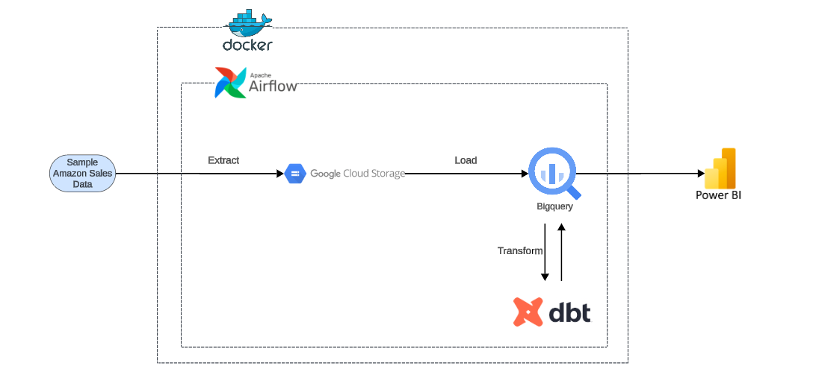
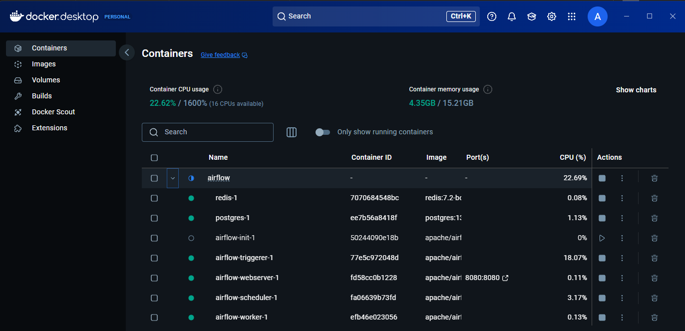
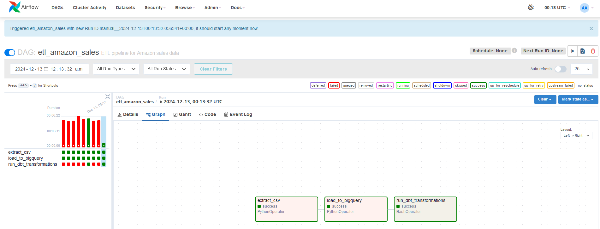
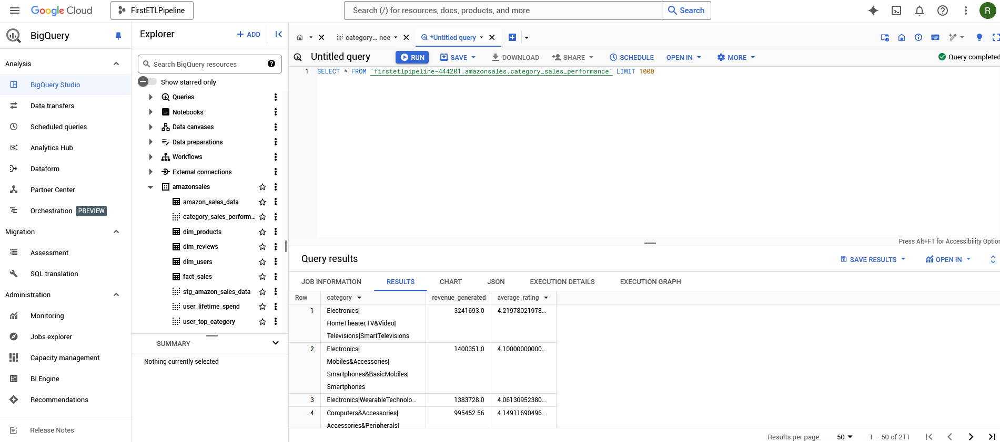
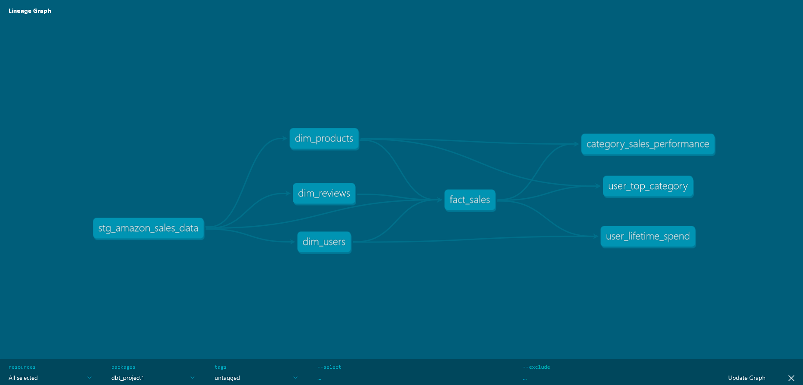

# first-etl-pipeline

- This is my first project building an ETL pipeline. Although I initially called this an ETL pipeline, I realized along the way that the tools I wanted to use actually orchestrated an ELT pipeline. I decided to leave the initial name of the project as ETL as this was the type of flow I was used to in my current work role. I see this as a way of reminding myself that as I began this project with limited understanding, I learned various new things along the way to build on my understanding of moving and transforming data. 

- The purpose of this project is to learn how to use the following tools specifically: Docker, Apache Airflow, BigQuery, and DBT. 

- This project utilizes running Apache Airflow locally inside a Docker container. Airflow runs my data extraction task, loads it into BigQuery, and then runs my DBT transformations. The resulting views from my DBT transformations are then visualized in Power BI. I did not spend very much time on Power BI so I apologize for the simplicity of it. The focus of this project was to successfully build the data pipeline within Airflow. 

- Version control done within this GitHub repository. 

- The raw data source was found on Kaggle, called "Amazon Sales Dataset EDA". 

Architecture Diagram

Dock Container

Airflow Graph

BigQuery

DBT Lineage Graph

